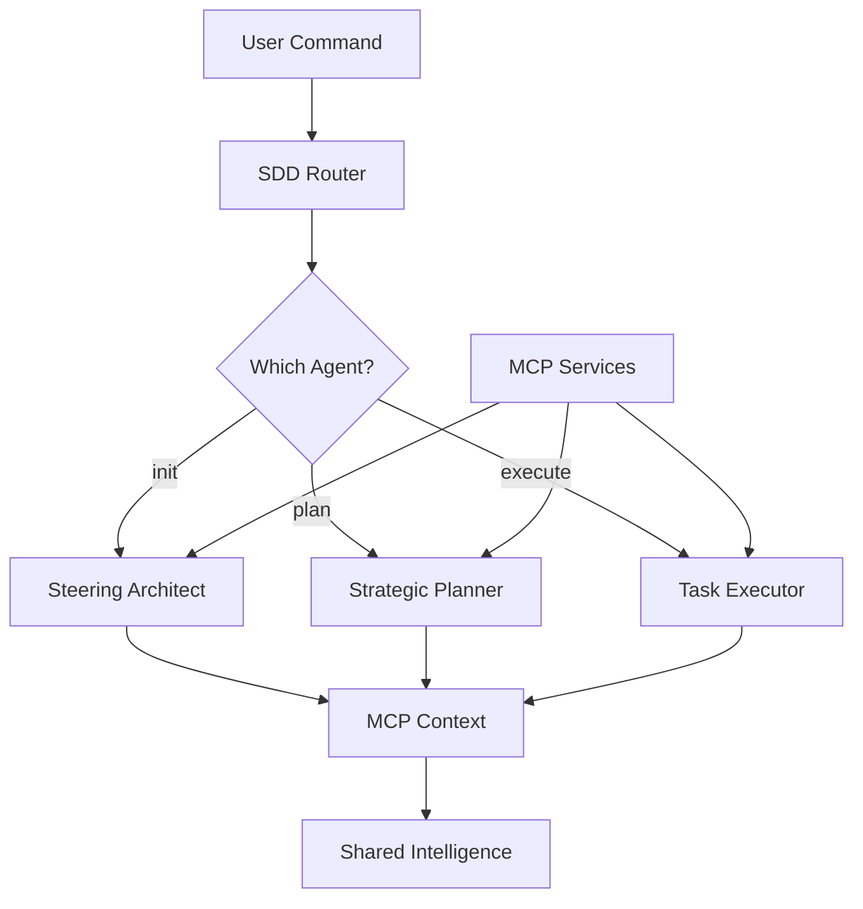

# SDD (Specification-Driven Development) Slash Commands with MCP Integration

A collection of slash commands implementing AWS Kiro-inspired SDD methodology with MCP-enhanced intelligence across three specialized AI agents.

## Architecture

This command system coordinates three MCP-enhanced agents:
- 🏗️ **Steering Architect** (`@agent:steering-architect`) - Project analysis with Context7 validation
- 📋 **Strategic Planner** (`@agent:strategic-planner`) - Requirements with Memory patterns  
- ⚙️ **Task Executor** (`@agent:task-executor`) - Implementation with hallucination prevention

## MCP Context Flow



## Enhanced Commands with MCP

### /sdd-init
Initialize project with MCP-validated architecture analysis.

**MCP Enhancement:**
- Context7: Validates all dependencies
- Memory: Finds similar project patterns
- Serena: Generates clear documentation

**Agent Invocation:**
```json
{
  "agent": "steering-architect",
  "mode": "init",
  "mcp_enabled": true,
  "services": ["context7", "memory", "serena"]
}
```

### /sdd-plan [feature]
Plan features with historical insights and requirement validation.

**MCP Enhancement:**
- Memory: Retrieves successful patterns
- Serena: Clarifies ambiguous requirements
- Context7: Validates technical feasibility

### /sdd-execute [task]
Execute with real-time hallucination prevention.

**MCP Enhancement:**
- Context7: Real-time code validation
- Memory: Applies best practices
- Serena: Auto-generates documentation

## MCP Context Passing Protocol

### Inter-Agent Context Schema

```typescript
interface MCPContext {
  session_id: string;
  
  // Validation data from Context7
  validation: {
    verified_packages: string[];
    invalid_packages: string[];
    api_validations: Record<string, boolean>;
    hallucinations_prevented: number;
  };
  
  // Historical insights from Memory
  patterns: {
    architecture_type: string;
    similar_projects: number;
    success_patterns: string[];
    common_pitfalls: string[];
  };
  
  // Documentation from Serena
  documentation: {
    clarity_score: number;
    generated_docs: string[];
    improvements: string[];
  };
  
  // Cumulative insights
  insights: {
    recommendations: string[];
    warnings: string[];
    optimizations: string[];
  };
}
```

### Command Flow with MCP Context

```javascript
// Pseudo-code for MCP-enhanced routing
async function routeSDDCommand(command, args) {
  // Initialize or retrieve MCP context
  const mcpContext = await getMCPContext(session.id);
  
  switch(command) {
    case '/sdd-init':
      const result = await invokeAgent('steering-architect', {
        mode: 'init',
        workspace: getCurrentWorkspace(),
        mcp_context: mcpContext
      });
      
      // Update context with architect findings
      mcpContext.validation = result.validation_results;
      mcpContext.patterns = result.pattern_analysis;
      break;
    
    case '/sdd-plan':
      // Pass enriched context to planner
      const planResult = await invokeAgent('strategic-planner', {
        mode: 'plan',
        feature: args.feature,
        mcp_context: mcpContext, // Includes validation data
        ai_rules: getAIRules()
      });
      
      // Update context with planning decisions
      mcpContext.insights.push(...planResult.decisions);
      break;
    
    case '/sdd-execute':
      // Execute with full context awareness
      const execResult = await invokeAgent('task-executor', {
        mode: 'execute',
        task: args.task,
        mcp_context: mcpContext, // Includes patterns & validation
        prevent_hallucinations: true
      });
      
      // Learn from execution
      await updateMCPMemory(execResult.learnings);
      break;
  }
  
  // Persist context for next command
  await saveMCPContext(mcpContext);
}
```

## MCP-Enhanced Status Command

### /sdd-status
Comprehensive status with MCP intelligence.

**Multi-Agent MCP Query:**
```yaml
steering_status:
  query: "@agent:steering-architect"
  mode: "status"
  include: ["tech_health", "validation_status"]

planning_status:
  query: "@agent:strategic-planner"
  mode: "active-specs"
  include: ["requirement_clarity", "pattern_matches"]

execution_status:
  query: "@agent:task-executor"
  mode: "task-progress"
  include: ["hallucinations_prevented", "quality_score"]
```

**Enhanced Output:**
```markdown
📊 **SDD Project Status with MCP Intelligence**

**Project Health:**
- Dependency Validation: 23/24 packages valid ✅
- Architecture Pattern: MVC (92% confidence)
- Code Quality Score: 96/100

**Active Feature:** user-authentication
- Requirements Clarity: 95% (Serena-validated)
- Similar Implementations: 47 found (Memory)
- Progress: 3/8 tasks (37.5%)

**MCP Metrics:**
- Hallucinations Prevented: 12 🛡️
- Best Practices Applied: 34 📚
- Documentation Generated: 15 files 📝

**Insights:**
- 🎯 Current velocity matches top 20% of similar projects
- ⚠️ Consider rate limiting (87% of similar projects needed it)
- 💡 Next task has 95% success rate with current approach

Use `/sdd-execute` to continue with MCP assistance
```

## Implementation Notes

1. **MCP Service Availability**: Ensure all three MCP services are accessible
2. **Context Persistence**: MCP context persists across commands in a session
3. **Learning Loop**: Successful executions feed back to Memory
4. **Validation First**: Context7 validates before any code generation
5. **Clear Communication**: Serena ensures all outputs are developer-friendly

## Quick Reference with MCP

| Command | Primary Agent | MCP Services Used |
|---------|--------------|-------------------|
| `/sdd-init` | steering-architect | Context7 (validation), Memory (patterns), Serena (docs) |
| `/sdd-plan` | strategic-planner | Memory (patterns), Serena (clarity), Context7 (feasibility) |
| `/sdd-execute` | task-executor | Context7 (anti-hallucination), Memory (best practices), Serena (comments) |
| `/sdd-status` | All agents | Aggregated MCP intelligence |
| `/sdd-review` | All agents | Comprehensive MCP analysis |